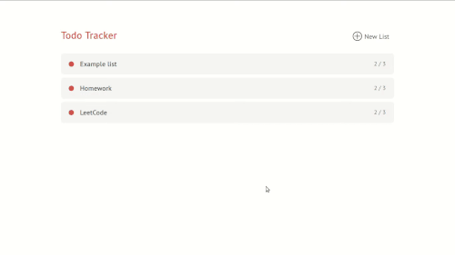

# Sinatra Todos&mdash;Database #

Database persistent Sinatra-backed ruby web application for creating,
viewing, editing, and deleting to-do lists and their respective to-dos. 

This is a todo list manager powered by Sinatra and PostgreSQL. It offers
permanent database persistence, multiple todo lists, each with their own
todos, and editable todos & todo lists.

<p align="center">
  
</p>

## Installation ##

To be able to run this server locally, you must have PostgreSQL installed on
your machine. To do this, enter these commands (for Debian-based GNU/Linux
users):

```
$ sudo apt update
$ sudo apt install postgresql postgresql-contrib libpq-dev
$ sudo -u postgres createuser --superuser $USER
# ^^ So you can connect to the server
$ sudo -u postgres createdb $USER
# ^^ To create a defaut database for use with the `psql` command
```

And optionally, to save your `psql` history, enter this command:

```
$ touch ~/.psql_history
```

Instructions for installing PostgreSQL can be found on [Launch School’s
installation instructions][install].

After you have installed the proper dependencies (`bundle install`, the
instructions for Postgres above) you need to then create the proper database
schema by running these commands:

```
$ echo 'CREATE DATABASE todos;' | psql
$ psql todos < schema.sql
```

After all of that, you can run the server with (`bundle exec rackup`) and
view the site at http://localhost:9292/.

[install]: https://launchschool.com/blog/how-to-install-postgres-for-linux
